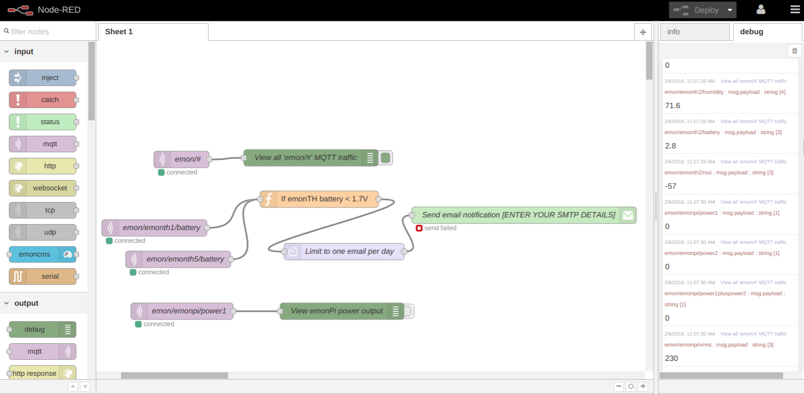

# oem_node-red

Default Node-RED config for emonPi

# Install

http://nodered.org/docs/hardware/raspberrypi.html

At time of writing (Assuming running Raspbian Jessie):

    sudo apt-get install nodered

## Start node Red at boot:

    sudo systemctl enable nodered.service

## View node Red log
(now in /var/syslog) filter with

    $ sudo journalctl -f -u nodered -o cat

## Move user data partition to RW ~/data partition on emonPi

    mv ~/.node-red ~/data/node-red

Test with:

    node-red-pi --max-old-space-size=128  --userDir /home/pi/data/node-red

Start at boot using custom user data location

    sudo nano /lib/systemd/system/nodered.service

Add line to the `[service]` section
  
    Environment="NODE_RED_OPTIONS=--userDir /home/pi/data/node-red"
    sudo systemctl daemon-reload
    sudo service nodered restart

## Install emoncms flow
    
    $ sudo apt-get install npm
    $ cd ~/data/node-red
    $ npm install node-red-node-emoncms
    
 
## Add authentication security for flow editor

### Generate password hash
    
    $ node-red-admin hash-pw
    
If required `$ sudo npm install bcryptjs`
*Alternate method `node -e "console.log(require('bcryptjs').hashSync(process.argv[1], 8));"  your-password`*

Copy generated password hash

    sudo nano /home/pi/data/node-red/settings.js

Uncomment adminAuth security section and insert username and password hash

*[Default settings file example](https://github.com/node-red/node-red/blob/master/settings.js)*
    
## Make authentication work with read-only file system (NOT USED)
ONLY NEEDED IF NOT MOVING USER FOLDER TO RW PARTITION
https://groups.google.com/forum/#!topic/node-red/qC0PC0yTpLk

    sudo nano ~/.node-red/settings.js

Add line:

    readOnly: true

in module.exports.

 The storage plugin won't do anything that writes to disk - the operations will silently fail, so the runtime will continue as normal, but nothing will be saved.
 
 *For future ref Node-RED install location: `/usr/lib/node_modules/node-red/`*

